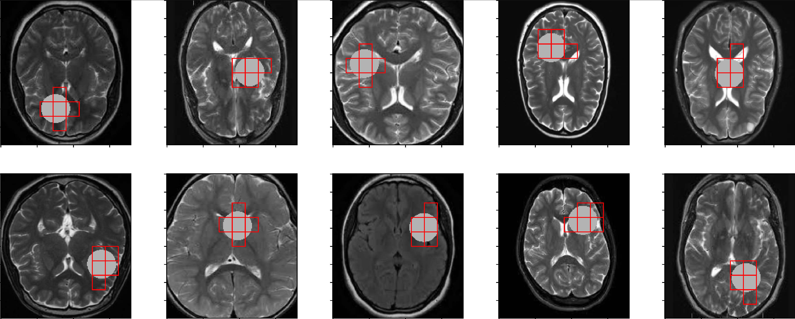
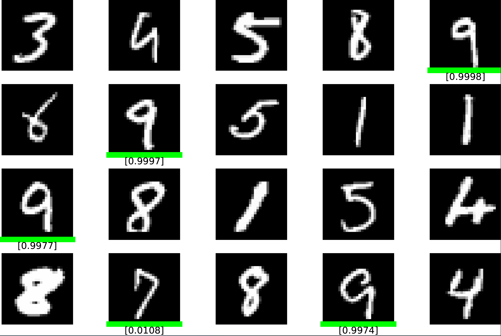

# Individualized Region Detection with Total Variation

## Citations

Wu, S., Wang F. and Feng, L. (2023)  Individualized Region Detection with Total Variation.

## Environment and usage

The following environments are required:

- Python 3.9.5 (anaconda is preferable)
- Pytorch '1.10.2+cu113'

### Code
We provide two examples: real MRI images with simulated signals and MNIST-bags.

The detailed usage refer to the **Tumor2d.ipynb** and **MNIST.ipynb**

##  Real images with simulated signals

An illustration of settings and our model performance. The red rectangles indicate the detected regions with top-5 probability within the local matrix of the image.

## MNIST-bags
An example illustration of our model prediction for a positive collection. The green line at the bottom indicates the patch with the highest probability among the top-5 patches.

